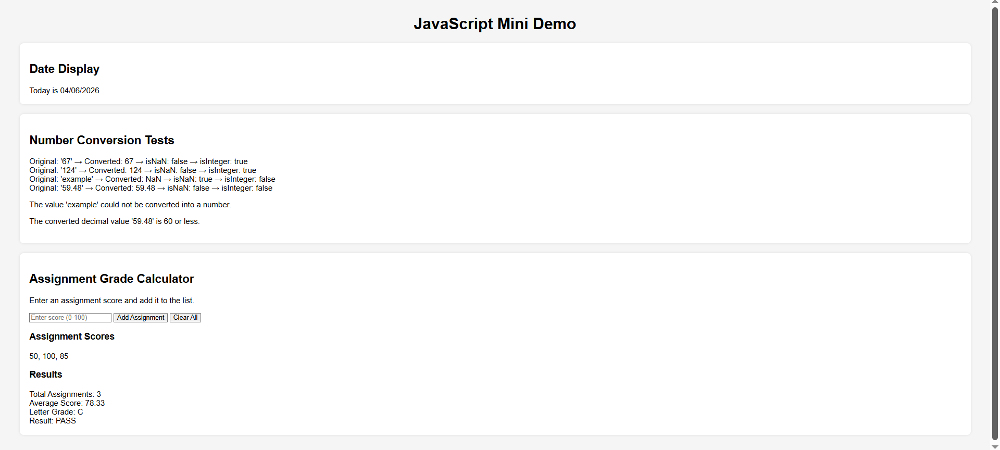

# comp484-hw9
comp484 hw9

Features:
1. **Date Display**
   - Uses the JavaScript `Date` object
   - Formats the current date as `MM/DD/YYYY`

2. **Number Conversion and Validation**
   - Converts string values to numbers using `Number()`
   - Checks results using:
     - `Number.isNaN()`
     - `Number.isInteger()`

3. **Assignment Grade Calculator**
   - Allows users to enter assignment scores
   - Calculates the average score from all entered values
   - Determines a letter grade using conditional logic
   - Displays a pass/fail result using a ternary operator
   - Formats the average using `toFixed(2)`

Pages link:
[**GitHub Pages link**](https://ryansommerhauser.github.io/comp484-hw9/)

Screen

Short Reflection:
    The Easiest part was definitely parts 1 and 2. They were pretty much just basic Javascripts with a few new simple concepts. The Hardest part was either the Grade Calculator drop down, or the css. The css was extremely basic so it didnt take very long, but css it still not something that comes natural to me. The Grade Calculator also wasnt that bad because I did something similar for my project, but it still took a little to work out. I learned a lot working on this. For the "Date" object I learned that it takes more than you would except to display it in the standard format like adding 0s where needed, for the "Number" object I learned how to use functions like isNaN() to test variables, and for the displaying I learned that at least when it comes to text it is pretty much as simple as making a string in Javascript that placing it on the page with html.